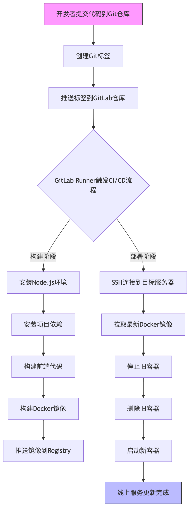
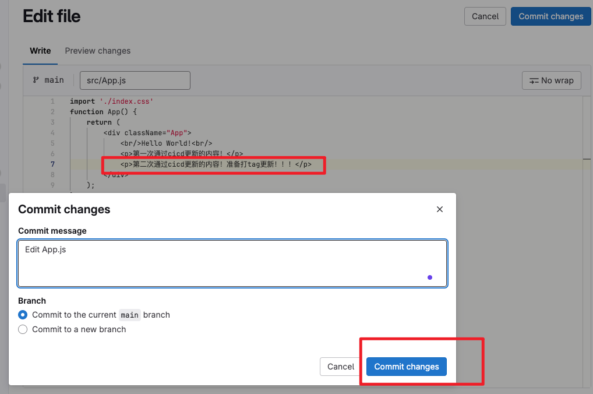
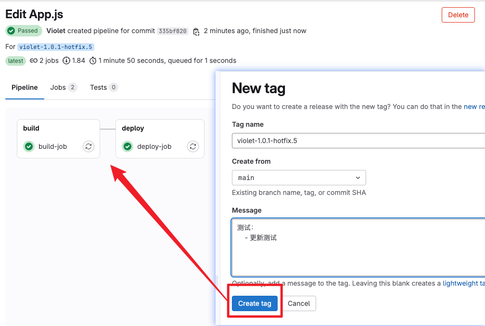
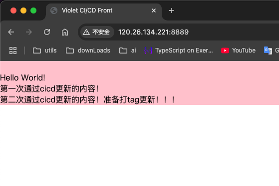
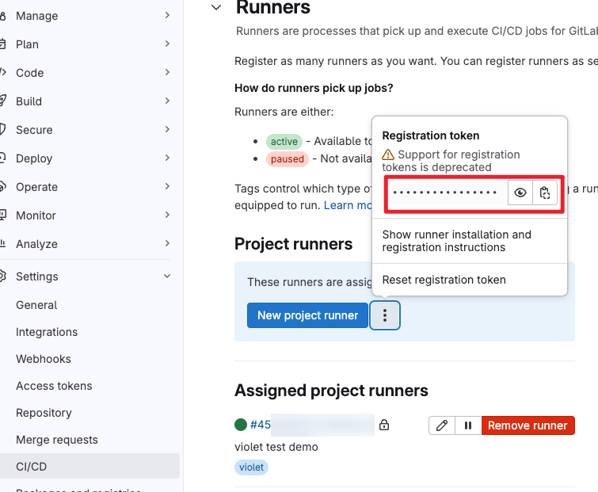

# 前端CICD自动化部署MVP

## 前言
> 持续集成/持续部署已经成了每个公司必备的业务流水线“利器”，而前端掌握这一搭建过程正变得越来越重要；

> gitlab操作地址：https://gitlab.com/violet1367509330/violet-cicd-front/-/pipelines 

## 部署流程


## 所需环境
- 业务项目（可打包生成index.html的都行，项目结构如下）
```
|-- violet-cicd-front
    |-- dist
    |-- node_modules
    |-- public
    |-- src
    |-- .babelrc
    |-- .gitignore
    |-- .gitlab-ci.yml  // required
    |-- Dockerfile  // required
    |-- nginx.conf  // required
    |-- package.json
    |-- package-lock.json
    |-- README.md
    |-- webpack.config.js
```

- Gitlab网站（项目上传）
- 服务器（单主机简单模拟，暂不启用k8s管理）
> 准备如下环境：
> 1. docker
> 2. nginx
## 效果
线上页面如下（http://120.26.134.221:8889/）  


进行代码更新演示：

1. 代码变更提交
   
2. 打tag触发更新部署
   
3. 更新完成
   

## 搭建细节
1. 服务器docker拉取最新的gitlab-runner镜像
```shell
docker pull gitlab/gitlab-runner:latest
```
2. gitlab远端仓库创建一个新的runner，查看连接信息如下
   
3. 服务器docker运行gitlab-runner镜像，填写信息与远端runner建立连接（上图绿色状态表示连接成功）
```shell
docker run -d \
  --name gitlab-runner \
  --restart always \  // 每次docker 重启时重启runner
  --network host \  // 容器与宿主机共享网络
  --mount type=bind,source=/var/run/docker.sock,target=/var/run/docker.sock \  // 容器与宿主机共享docker.sock
  --mount type=bind,source=/home/chenhebin/soft/violet-docker/gitlab-runner/config,target=/etc/gitlab-runner \ // 容器与宿主机共享配置文件，达到主机文件和容器文件互通同步
  gitlab/gitlab-runner:latest
```

```shell
[root ~]# docker ps
CONTAINER ID   IMAGE                                                                     COMMAND                   CREATED          STATUS          PORTS                            NAMES
e757a420b5f7   gitlab/gitlab-runner:latest                                               "/usr/bin/dumb-init …"   2 weeks ago      Up 7 days                                        gitlab-runner
```
4. 配置ci文件（gitlab仓库需要储存敏感账号密码等信息，用"$args"参数形式注入到ci文件中使用）
- 第一阶段：打包阶段
> 会把项目进行打包，然后运行docker build命令，这个命令会自动基于项目中的Dockerfile文件进行打包，并生成镜像，最后推送远端私人仓库中
```yaml
build-job:
  stage: build
  image: node:20
  except:
    variables:
      - $VIOLET_DEPLOY_ONLY == "true"  # 当设置了这个变量时跳过构建
  only:
    - tags
  before_script:
    - export PROJECT_NAME=$(cat package.json | grep name | head -1 | awk -F "[\"]" '/name/{print$4}') # 获取 package.json 中的 name 字段
    - export BUILD_TAG=${CI_COMMIT_TAG:-latest}-$PROJECT_NAME  # 设置默认值为 latest
    - apt-get update && apt-get install -y docker.io  # 安装 Docker
    - service docker start  # 启动 Docker 服务
  script:
    - echo "Compiling the code..."
    - npm install  # 安装依赖
    - npm run build # 编译代码
    - docker info  # 确认 Docker 是否可用
    - echo "Login to Docker Hub"
    - echo $VIOLET_DOCKER_PASSWORD | docker login -u $VIOLET_DOCKER_EMAIL --password-stdin # 登录到 Docker Hub
    - docker build -t $VIOLET_REGISTRY/$VIOLET_DOCKER_IMAGE_NAME:$BUILD_TAG .  # 使用构建好的文件生成 Docker 镜像
    - docker push $VIOLET_REGISTRY/$VIOLET_DOCKER_IMAGE_NAME:$BUILD_TAG # 将镜像推送到 Docker Hub
  artifacts:
    paths:
      - dist/  # 保存构建产物，以便后续部署
  cache:
    paths:
      - node_modules/ # 缓存依赖包
```

- 第二阶段：部署阶段
> 登录到服务器，并拉取镜像，然后运行容器，如果容器存在则先停止，再删除，最后运行容器
```yaml
deploy-job:
  stage: deploy
  image: alpine:latest
  before_script:
    - export PROJECT_NAME=$(cat package.json | grep name | head -1 | awk -F "[\"]" '/name/{print$4}') # 获取 package.json 中的 name 字段
    - export BUILD_TAG=${CI_COMMIT_TAG:-latest}-$PROJECT_NAME  # 设置默认值为 latest
    - apk update && apk add --no-cache openssh-client # 安装 SSH 客户端
    - mkdir -p ~/.ssh # 创建 .ssh 目录
    - echo "$VIOLET_PRIVATE_ID_RSA" > ~/.ssh/id_rsa # 将私钥写入文件（这是你服务器本机的私钥，通过run gitlab-runner时候设置的文件路径互通得到）
    - chmod 600 ~/.ssh/id_rsa # 设置私钥权限
    - ssh-keyscan -H "$VIOLET_SERVER_IP" >> ~/.ssh/known_hosts # 添加服务器的公网ip输出到 known_hosts 文件
  script:
    - echo "Deploying application to server..."
    - apk add --no-cache openssh # 安装 SSH 客户端
    - ssh -i ~/.ssh/id_rsa -o StrictHostKeyChecking=no $VIOLET_SERVER_USER@$VIOLET_SERVER_IP " # 登录到服务器
      docker pull $VIOLET_REGISTRY/$VIOLET_DOCKER_IMAGE_NAME:$BUILD_TAG && docker stop hello_world_cicd_container_test || true && docker rm -f hello_world_cicd_container_test || true && docker run -d --name hello_world_cicd_container_test -p $VIOLET_DEPLOY_PORT:$VIOLET_DEPLOY_PORT $VIOLET_REGISTRY/$VIOLET_DOCKER_IMAGE_NAME:$BUILD_TAG" # 运行 Docker 容器
  only:
    - tags
```
5. 访问http://120.26.134.221:8889来查看线上资源
- 实质是访问docker pull下来的那个容器里的那个端口，所以docker run 的时候要设置主机端口和docker端口的映射
- 然后docker容器中需要设置ng来进行转发，命中访问资源（dockerfile文件内容实例如下）
```dockerfile
FROM nginx:1.25-alpine

# 标准Nginx配置路径（关键修正）
COPY nginx.conf /etc/nginx/nginx.conf

# 静态文件部署路径（需与nginx.conf中的root一致）
COPY ./dist /usr/share/nginx/html
```
- 同目录下有nginx.conf文件内容实例如下
```
user  nginx;
worker_processes  auto;

error_log  /var/log/nginx/error.log notice;
pid        /var/run/nginx.pid;

events {
    worker_connections  1024;
}

http {
    include       /etc/nginx/mime.types;
    default_type  application/octet-stream;

    log_format  main  '$remote_addr - $remote_user [$time_local] "$request" '
                      '$status $body_bytes_sent "$http_referer" '
                      '"$http_user_agent" "$http_x_forwarded_for"';

    access_log  /var/log/nginx/access.log  main;

    sendfile        on;
    keepalive_timeout  65;

    # 关键服务配置（处理前端路由）
    server {
        listen       8889;
        server_name  localhost;

        location / {
            root   /usr/share/nginx/html;
            index  index.html index.htm;
            try_files $uri $uri/ /index.html;
        }

        # 代理后端API示例（按需添加）
        # location /api/ {
        #     proxy_pass http://backend:8000;
        # }
    }
}

```
## 至此，完成了一个简易的自动化cicd流水线
